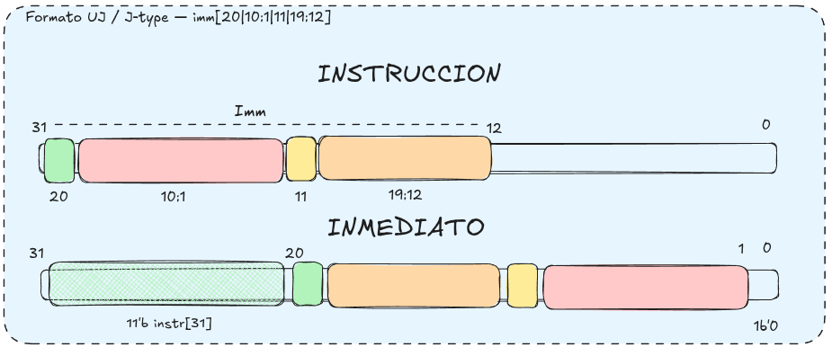
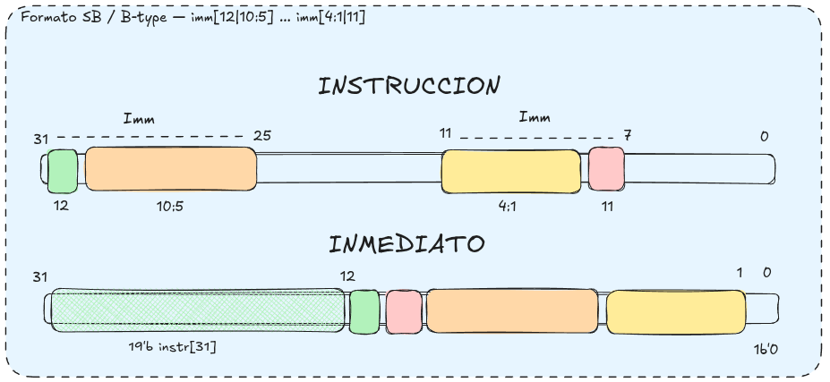

# Consideraciones de diseño

Registro breve de decisiones de arquitectura no obvias.

---

## C-001 — PC byte-addressed (`PC + 4`) en lugar de word-addressed (`PC + 1`)

**Fecha:** 2026-06-13
**Estado:** resuelto / implementado
**Etapas afectadas:** IF (`InstructionFetch`, `InstructionMemory`), EX (`ExecuteStage`)

### Discusión

El diseño original usaba un **PC word-addressed**: incrementaba de a 1, la
`InstructionMemory` indexaba el array de palabras directo con el PC, y el branch
target convertía el offset de bytes a palabras con `>>> 2`:

```systemverilog
// IF: PC + 1
// branch_target = PC + (sign_ext(imm) >>> 2)
```

El libro de referencia (Patterson & Hennessy, *RISC-V edition*, §4.3, Fig. 4.9)
usa un **PC byte-addressed**: el PC cuenta bytes (`PC + 4`) y el branch target se
calcula como `PC + (imm << 1)`. El `<< 1` ("Shift left 1") **no es hardware**: es
puro cableado que apenda un `0` al bit menos significativo del offset, porque el
inmediato B-type guarda solo `imm[12:1]` (offset en half-words).

La pregunta fue: ¿por qué el libro hace `<< 1` y el desarrollo hacía `>>> 2`?

- **`<< 1` (libro):** convierte el inmediato de *half-words → bytes*, porque su PC
  cuenta bytes.
- **`>>> 2` (diseño original):** convertía el byte offset (que `ImmediateExtend`
  ya produce, gracias al `1'b0` que apenda en el LSB del B/J-type) de
  *bytes → palabras*, porque el PC contaba palabras.

Es decir, el `ImmediateExtend` ya hacía el `<< 1` del libro internamente, y luego
el `>>> 2` lo dividía de nuevo: una doble conversión redundante, y una convención
distinta a la del libro.

### Decisión

Alinear con el libro: **PC byte-addressed, incremento de a 4**. Cambios:

1. `InstructionFetch.sv` — el sumador del PC suma `4` (antes `1`).
2. `InstructionMemory.sv` — el fetch indexa con `PC >> 2`
   (`i_PC[NB_ADDR+1:2]`); el puerto de carga por debug sigue usando índice de
   palabra.
3. `ExecuteStage.sv` — se **elimina** el `>>> 2`: el inmediato ya es un byte
   offset y el PC está en bytes, así que `branch_target = PC + imm` directo.
   (Reemplazar por `<< 1` habría sido **incorrecto**: duplicaría el offset, porque
   el `ImmediateExtend` ya incluye el `<< 1` del libro.)
4. La señal `pc_plus_1` se renombró a `pc_plus_4` en todo el pipeline (la
   dirección de retorno de JAL/JALR pasa a ser `PC + 4`, generada por el sumador
   de IF; no hace falta un sumador aparte).

### Resultado

- Suite de tests: **117 passed, 10 failed**. Los 10 fallos son el bug conocido
  preexistente [BUG-001 (LUI)](known-bugs.md), no relacionado con este cambio.
- `tb_branch` (BNE loop + JAL): 6/6 ✓ — la dirección de retorno de JAL pasó de
  `x1 == 1` a `x1 == 4`, como corresponde al modelo byte-addressed.
- `tb_IF_to_WB`: 6/6 ✓.
- Beneficio adicional: JALR con offset no nulo ahora funciona (antes era una
  limitación del diseño word-addressed; ver [`plans/stage8.md`](../plans/stage8.md)).

### Fuera de alcance

- **`DataMemory`** (LW/SW/LH/SH) sigue siendo **word-addressed**. Es un eje de
  direccionamiento independiente del PC y no se modificó en este cambio. Queda
  como deuda conocida si se busca consistencia byte-addressed end-to-end.

---

## C-002 — Cómo leer la notación de inmediatos B-type y J-type

**Fecha:** 2026-06-21
**Estado:** nota de referencia
**Etapas afectadas:** ID (`ImmediateExtend`)

### Discusión

La notación `imm[20|10:1|11|19:12]` (J-type) o `imm[12|10:5] ... imm[4:1|11]`
(B-type) **no** lista los bits del inmediato en orden. Describe **en qué orden
físico aparecen los trozos del inmediato dentro de la instrucción**, leyendo de
izquierda (MSB de la instrucción, `inst[31]`) a derecha. Cada número o rango
indica **a qué posición del inmediato** va ese trozo. El hardware lee esos
pedazos y los rearma en su lugar correcto.

Este "desorden" es deliberado: el bit de signo es siempre `inst[31]` en todos los
formatos (arranca el sign-extend sin esperar el opcode), y los bits comunes entre
formatos parecidos (S↔B, U↔J) se mantienen en la misma posición física para
reutilizar cableado y reducir muxes.

El formato es así por **hardware más barato**: el ISA acepta complicar al
ensamblador/decoder (que rebaraja bits una sola vez en software) a cambio de
simplificar el ruteo de inmediatos, que está en el camino crítico de cada
instrucción y se paga en silicio en cada chip.

El `imm[0]` implícito siempre es `0` (saltos alineados a 2 bytes): es el `1'b0`
que `ImmediateExtend` apenda en el LSB, y que cumple el rol del `<< 1` del libro
(ver [C-001](#c-001--pc-byte-addressed-pc--4-en-lugar-de-word-addressed-pc--1)).

### Formato UJ / J-type — `imm[20|10:1|11|19:12]`



| bits de la instrucción | bit del inmediato |
|---|---|
| `inst[31]`    | `imm[20]`    |
| `inst[30:21]` | `imm[10:1]`  |
| `inst[20]`    | `imm[11]`    |
| `inst[19:12]` | `imm[19:12]` |

```systemverilog
wire [20:0] imm_j = { inst[31], inst[19:12], inst[20], inst[30:21], 1'b0 };
// luego sign-extend con inst[31]
```

### Formato SB / B-type — `imm[12|10:5] ... imm[4:1|11]`



| bits de la instrucción | bit del inmediato |
|---|---|
| `inst[31]`    | `imm[12]`   |
| `inst[30:25]` | `imm[10:5]` |
| `inst[11:8]`  | `imm[4:1]`  |
| `inst[7]`     | `imm[11]`   |

```systemverilog
wire [12:0] imm_b = { inst[31], inst[7], inst[30:25], inst[11:8], 1'b0 };
// luego sign-extend con inst[31]
```

### Nota de nomenclatura

"SB-type" y "UJ-type" son los nombres antiguos (spec ≤ 2.0). En el manual actual
de RISC-V y en Patterson & Hennessy se llaman **B-type** y **J-type**
respectivamente. Son el mismo formato; solo cambió la denominación.

---

## C-003 — La lista de instrucciones del TP está en mnemónicos MIPS

**Fecha:** 2026-06-22
**Estado:** nota de referencia
**Etapas afectadas:** ID (`ControlUnit`, `ALUControl`), MEM (`DataMemory`)

### Discusión

La lista de instrucciones del enunciado (`plans/TRABAJO_FINAL_2025.md`) usa
mnemónicos de **MIPS**, no de RISC-V (el template fue adaptado de un curso de
MIPS). El set RISC-V implementado cubre todos sus equivalentes:

| TP (MIPS) | RISC-V implementado |
|---|---|
| SLLV, SRLV, SRAV (shift por registro) | SLL, SRL, SRA |
| SLL, SRL, SRA (shift por inmediato)   | SLLI, SRLI, SRAI |
| ADDU, SUBU | ADD, SUB |
| ADDIU | ADDI |
| J  | `JAL x0` (pseudo) |
| JR | `JALR x0` (pseudo) |

`J` y `JR` no necesitan hardware propio: el ensamblador los emite como `JAL`/`JALR`
con `rd = x0`, ya soportados.

### Decisión sobre `NOR`

`NOR` figura en la lista del TP pero **no existe en RISC-V** (no tiene opcode/funct
asignado). Se considera **no aplicable** y no se implementa; sería una extensión
custom fuera del ISA. Todo el resto de la lista está implementado, sin
instrucciones de más (AUIPC se removió por no estar pedida).

---

## C-004 — Instrucción HALT: opcode dedicado vs. self-loop

**Fecha:** 2026-06-22
**Estado:** decisión pendiente (Stage 9/10)
**Etapas afectadas:** ID (`ControlUnit`), Buffers, Debug Unit

### Discusión

El TP exige *"una instrucción HALT o instrucción de stop"*
(`docs/TRABAJO_FINAL_2025.md:141`) y que **el pipeline quede vacío al terminar la
ejecución** (`:171`). El libro de Patterson & Hennessy **no define HALT**: el
subset RISC-V del cap. 4 asume ejecución continua y lo más cercano es el manejo de
excepciones (§4.9). En el RISC-V real tampoco hay HALT en RV32I (lo análogo sería
`EBREAK`/`ECALL`, o `WFI` en la spec privilegiada). Es decir: HALT es **custom**,
lo definimos nosotros.

Hay dos enfoques sobre la mesa:

1. **Self-loop `jal x0, 0`** (lo que hoy propone `plans/plan.md:228`): no es una
   instrucción nueva, se reutiliza JAL. La Debug Unit detecta el self-loop por
   fuera y dispara el dump. Simple, pero **no detiene el procesador ni vacía el
   pipeline**: el PC sigue refetcheando la misma instrucción para siempre. No
   cumple bien el requisito `:171`.

2. **Opcode HALT dedicado** (MIPS de referencia): es una instrucción real con opcode propio
   (allí `HALT_OPCODE = 6'h3f`). La `ControlUnit` la decodifica y levanta una
   señal `halt` que **viaja por los buffers de pipeline** como un bit de control
   más. Cuando llega a MEM/WB, la unidad de hazard/stall hace **flush de IF, ID y
   EX** (drena las instrucciones posteriores para que no escriban en memoria ni en
   registros) y se expone un `o_halt` al top/Debug Unit para señalar fin de
   programa. Este enfoque **sí vacía el pipeline** y es más fiel al enunciado.

### Decisión (tentativa)

Adoptar el **opcode HALT dedicado** (enfoque 2), por dos razones: cumple el
requisito de pipeline vacío y responde directamente la pregunta del TP *"¿qué pasa
si en memoria no hay una instrucción de parada?"* (`:174`) — sin HALT, el
procesador sigue ejecutando lo que haya después del programa. Resta elegir el
encoding concreto en RISC-V (opcode libre del espacio custom) al llegar a Stage 9.
Actualizar `plans/plan.md` en consecuencia.
