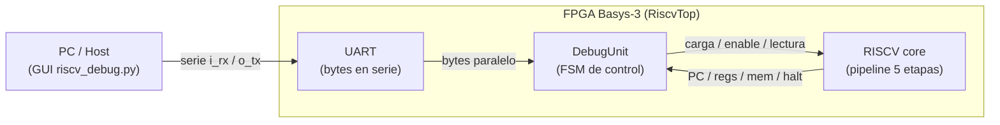
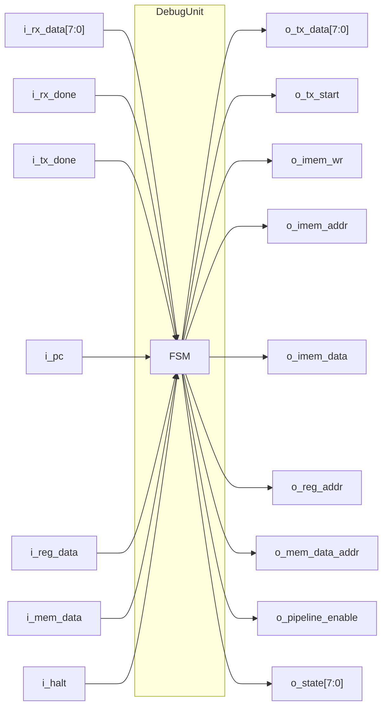
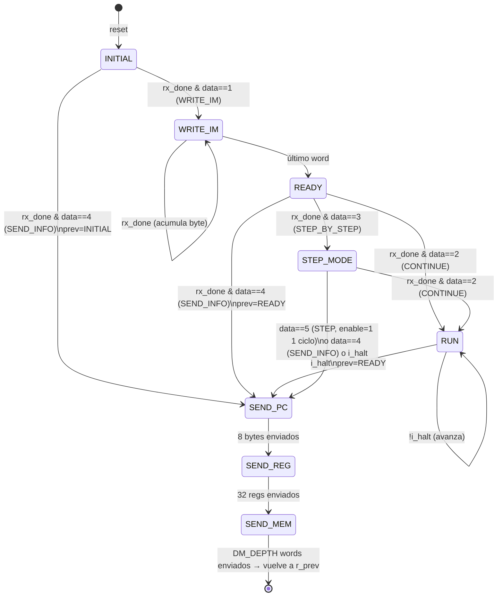
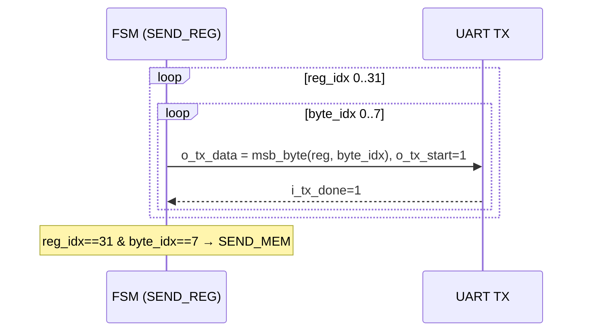
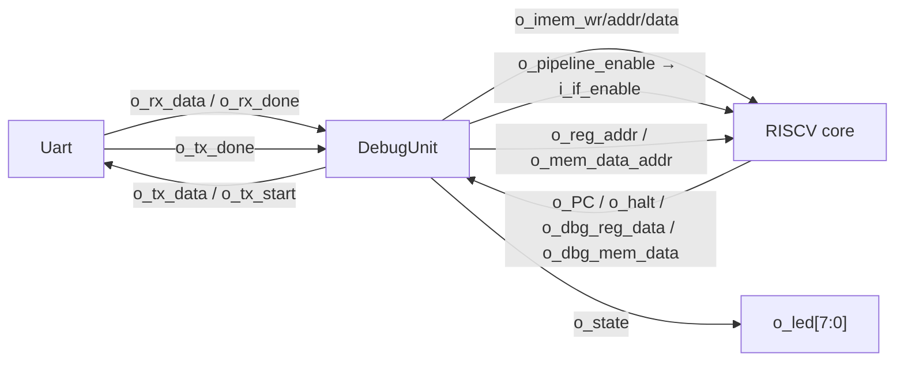

# DebugUnit — Teoría, protocolo e integración

Este documento explica, de menor a mayor nivel, cómo la `DebugUnit` conecta el
mundo serie (UART / PC) con el pipeline RISC-V:

1. [Qué es la DebugUnit y por qué existe](#1-qué-es-la-debugunit-y-por-qué-existe)
2. [El protocolo de comandos sobre UART](#2-el-protocolo-de-comandos-sobre-uart)
3. [Endianness: MSB-first / big-endian](#3-endianness-msb-first--big-endian)
4. [Arquitectura, parámetros e interfaz](#4-arquitectura-parámetros-e-interfaz)
5. [La FSM: estados y transiciones](#5-la-fsm-estados-y-transiciones)
6. [`INITIAL` y `WRITE_IM` — carga del programa](#6-initial-y-write_im--carga-del-programa)
7. [`READY`, `RUN` y `STEP_MODE` — control de ejecución](#7-ready-run-y-step_mode--control-de-ejecución)
8. [`SEND_PC` / `SEND_REG` / `SEND_MEM` — el dump](#8-send_pc--send_reg--send_mem--el-dump)
9. [Mecanismos clave](#9-mecanismos-clave)
10. [Integración: `RiscvTop` y el gating del pipeline](#10-integración-riscvtop-y-el-gating-del-pipeline)
11. [Secuencia completa de uso (PC ↔ DebugUnit ↔ core)](#11-secuencia-completa-de-uso)
12. [Parámetros, pines y cómo probar](#12-parámetros-pines-y-cómo-probar)
13. [Limitaciones conocidas](#13-limitaciones-conocidas)

> El módulo vive en `src/sources_1/Debug/DebugUnit.sv`. Es el corazón de la
> Stage 9b: el puente entre la [`UART`](UART.md) (9a) y el core `RISCV`. Es la
> portación a SystemVerilog (y datapath de 64 bits) del `debug_unit.v` del
> proyecto MIPS de base.

---

## 1. Qué es la DebugUnit y por qué existe

La **DebugUnit** es una **máquina de estados (FSM)** que actúa como **único puente**
entre la UART y el pipeline. La UART solo sabe mover **bytes sueltos** en serie; el
pipeline necesita instrucciones de 32 bits en memoria, una señal de habilitación y
direcciones para leer su estado. Alguien tiene que traducir entre esos dos mundos:
esa es la DebugUnit.

Cumple cuatro funciones:

| Función | Qué hace |
|---------|----------|
| **Carga de programa** | Recibe el binario byte a byte por UART, ensambla cada 4 bytes en una instrucción de 32 bits y la escribe en la `InstructionMemory` del core. |
| **Ejecución continua** | Habilita el pipeline (`pipeline_enable=1`) y lo deja correr hasta detectar `HALT`. |
| **Paso a paso** | Avanza **exactamente un ciclo** por comando y vuelve a congelar el core. |
| **Volcado (dump)** | Lee el `PC`, los 32 registros y la memoria de datos, y los transmite de vuelta a la PC por UART. |



**La UART nunca habla directo con el pipeline.** Si la UART es el *cartero* (mueve
bytes sin entender qué significan), la DebugUnit es el *bootloader + debugger* que
interpreta los mensajes, carga el programa, arranca/frena el CPU y reporta el estado.

---

## 2. El protocolo de comandos sobre UART

El protocolo es **8N1, MSB-first**, compatible con la GUI Python. Todo arranca con un
**byte de comando**:

| Byte | Comando | Efecto |
|------|---------|--------|
| `0x01` | `CMD_WRITE_IM` | Iniciar carga del programa |
| `0x02` | `CMD_CONTINUE` | Ejecución continua hasta `HALT` |
| `0x03` | `CMD_STEP_BY_STEP` | Entrar al modo paso a paso |
| `0x04` | `CMD_SEND_INFO` | Volcar el estado (PC + registros + memoria) |
| `0x05` | `CMD_STEP` | Avanzar un ciclo (dentro de paso a paso) |

### Formato de la carga (tras `0x01`)

```
0x01  │  inst[0] (4 bytes)  │  inst[1] (4 bytes)  │ ... │  inst[IM_WORDS-1] (4 bytes)
      └─ cada instrucción: byte MÁS significativo primero (b31..b24, b23..b16, ...) ─┘
```

Se envían **`IM_WORDS` instrucciones × 4 bytes** = `64 × 4 = 256 bytes`. La GUI hace
*zero-padding*: rellena con ceros hasta `IM_WORDS`, y los ceros decodifican como NOPs.

### Formato del dump (tras `0x04`, o automático al `HALT`)

Siempre en este orden, cada valor de **8 bytes** (64 bits) MSB-first:

```
PC (8 bytes)  →  reg[0] … reg[31] (32 × 8 bytes)  →  mem[0] … mem[DM_DEPTH-1] (64 × 8 bytes)
```

Total del dump = `8 + 32×8 + 64×8 = 8 + 256 + 512 = 776 bytes`.

---

## 3. Endianness: MSB-first / big-endian

Tanto la carga como el dump van **byte más significativo primero** (big-endian).
Esto aparece en dos lugares del código.

### Ensamblado en la carga (`WRITE_IM`)

Cada byte que llega entra **por abajo** del acumulador, desplazando lo anterior hacia
los bits altos:

```systemverilog
w_next_im_acc = {r_im_acc[NB_INST-9:0], i_rx_data};
//               └────── lo viejo se corre a la izquierda ──────┘ └ byte nuevo abajo
```

Tras 4 bytes, el **primero** que llegó terminó en `[31:24]` (el más significativo):

```
 llega B0:  acc = 00_00_00_B0
 llega B1:  acc = 00_00_B0_B1
 llega B2:  acc = 00_B0_B1_B2
 llega B3:  acc = B0_B1_B2_B3   ← B0 quedó arriba (MSB)  ✓
```

### Serialización en el dump (`msb_byte`)

Una función extrae el byte `idx` contando desde el más significativo:

```systemverilog
function automatic logic [NB_DATA-1:0] msb_byte(input logic [DATA_WIDTH-1:0] val,
                                                input logic [2:0] idx);
    msb_byte = val[(NB_BYTES-1-idx)*8 +: 8];   // idx=0 → byte MÁS significativo
endfunction
```

Con `NB_BYTES = 8`: `idx=0` devuelve `val[63:56]`, `idx=7` devuelve `val[7:0]`.

> Es independiente del *bit order* de la UART (que es LSB-first dentro de cada byte):
> acá hablamos del **orden de los bytes** dentro de un valor multibyte.

> `+:` es "seleccioná N bits desde esta posición hacia arriba". Sintaxis `val[base +: ancho]` "agarrá ancho bits empezando en base y subiendo". > Es equivalente a val[base + ancho - 1 : base], pero con una ventaja clave: la base puede ser una variable y el ancho es constante.
---

## 4. Arquitectura, parámetros e interfaz

### Parámetros (defaults)

| Parámetro | Valor | Significado |
|-----------|-------|-------------|
| `NB_DATA` | 8 | ancho de byte UART |
| `NB_PC` | 64 | ancho del PC |
| `DATA_WIDTH` | 64 | ancho de registros / memoria de datos |
| `NB_REG` | 5 | bits de dirección del banco (32 registros) |
| `NB_IADDR` | 8 | bits de dirección de la IM (índice de word) |
| `NB_INST` | 32 | ancho de instrucción |
| `NB_DADDR` | 6 | bits de dirección de la mem de datos (64 words) |
| `IM_WORDS` | 64 | instrucciones del programa (debe coincidir con la GUI) |
| `RB_DEPTH` | 32 | registros a volcar |
| `DM_DEPTH` | 64 | words de memoria de datos a volcar |

`NB_BYTES = DATA_WIDTH/8 = 8` → cada valor del dump son 8 bytes.

### Interfaz de puertos



| Puerto | Dir | Conecta con | Significado |
|--------|-----|-------------|-------------|
| `i_rx_data` / `i_rx_done` | in | UART | byte recibido / pulso "hay byte" |
| `o_tx_data` / `o_tx_start` | out | UART | byte a transmitir / iniciar TX |
| `i_tx_done` | in | UART | pulso "terminó de transmitir" |
| `o_imem_wr` / `o_imem_addr` / `o_imem_data` | out | core (IF) | escritura a la `InstructionMemory` |
| `i_pc` | in | core (IF) | PC actual (para el dump) |
| `o_reg_addr` / `i_reg_data` | out/in | core (ID) | dirección y valor de registro (dump) |
| `o_mem_data_addr` / `i_mem_data` | out/in | core (MEM) | dirección y valor de mem de datos (dump) |
| `i_halt` | in | core (MEM/WB) | `HALT` llegó al final del pipeline |
| `o_pipeline_enable` | out | core | 1 = el core avanza; 0 = congelado |
| `o_state` | out | LEDs | estado one-hot de la FSM (debug visual) |

---

## 5. La FSM: estados y transiciones

Los estados son **one-hot** (cada uno enciende un LED distinto en `o_state`):

```systemverilog
typedef enum logic [7:0] {
    INITIAL   = 8'b0000_0001,  // reposo: espera WRITE_IM o SEND_INFO
    WRITE_IM  = 8'b0000_0010,  // recibiendo y escribiendo el programa
    READY     = 8'b0000_0100,  // programa cargado: espera CONTINUE / STEP_BY_STEP
    RUN       = 8'b0000_1000,  // ejecución continua hasta HALT
    STEP_MODE = 8'b0001_0000,  // paso a paso: espera STEP / CONTINUE
    SEND_PC   = 8'b0010_0000,  // transmitiendo el PC
    SEND_REG  = 8'b0100_0000,  // transmitiendo el banco de registros
    SEND_MEM  = 8'b1000_0000   // transmitiendo la memoria de datos
} state_t;
```



La FSM es del tipo **Mealy parcial con registros de salida**: hay un bloque
`always_comb` que calcula `w_next_*` (próximo estado y próximos valores), y un
`always_ff` que los registra. Todas las salidas (`o_*`) son **registradas**
(`assign o_x = r_x;`), salvo `o_state` que es `r_state`.

> **Patrón de defaults:** el `always_comb` arranca copiando todo (`w_next_x = r_x;`)
> para *mantener* el estado por defecto. La única excepción es `w_next_mem_wr = 1'b0`,
> que es un **pulso**: vale 1 solo el ciclo en que se escribe un word a la IM.

---

## 6. `INITIAL` y `WRITE_IM` — carga del programa

### `INITIAL` (reposo)

Mantiene `pipeline_enable = 0` (core congelado). Espera un byte de comando:

```systemverilog
INITIAL: begin
    w_next_pipeline_enable = 1'b0;
    if (i_rx_done) begin
        case (i_rx_data)
            CMD_WRITE_IM:  // → WRITE_IM, resetea contadores de carga
            CMD_SEND_INFO: // → SEND_PC con prev=INITIAL (dump sin programa)
            default: ;     // ignora cualquier otro byte
        endcase
    end
end
```

### `WRITE_IM` (recepción del programa)

Por cada byte que llega (`i_rx_done`), lo mete en el acumulador `r_im_acc`. Cuenta los
bytes con `r_byte_in_word` (0→3). En el **4.º byte** escribe el word completo:

```systemverilog
WRITE_IM: begin
    w_next_pipeline_enable = 1'b0;
    if (i_rx_done) begin
        w_next_im_acc = {r_im_acc[NB_INST-9:0], i_rx_data};   // ensambla MSB-first
        if (r_byte_in_word == 2'd3) begin
            w_next_mem_wr  = 1'b1;                             // pulso de escritura
            w_next_im_addr = r_word_count;                    // índice de word
            w_next_im_data = {r_im_acc[NB_INST-9:0], i_rx_data};
            w_next_byte_in_word = 2'd0;
            if (r_word_count == NB_IADDR'(IM_WORDS-1))
                w_next_state = READY;                          // último word → listo
            else
                w_next_word_count = r_word_count + 1'b1;
        end else
            w_next_byte_in_word = r_byte_in_word + 1'b1;
    end
end
```

```
 word 0:  B0 B1 B2 B3 → o_imem_wr=1, o_imem_addr=0, o_imem_data=B0B1B2B3
 word 1:  B0 B1 B2 B3 → o_imem_wr=1, o_imem_addr=1, ...
 ...
 word 63: B0 B1 B2 B3 → o_imem_wr=1, o_imem_addr=63 → READY
```

El core nunca avanza durante la carga (`pipeline_enable=0`), así que la
`InstructionMemory` se escribe con el pipeline congelado.

---

## 7. `READY`, `RUN` y `STEP_MODE` — control de ejecución

### `READY` (programa cargado)

Core congelado. Espera el comando de ejecución:

| Byte | Acción |
|------|--------|
| `0x02` `CONTINUE` | → `RUN` |
| `0x03` `STEP_BY_STEP` | → `STEP_MODE` |
| `0x04` `SEND_INFO` | → dump (`prev=READY`) |

### `RUN` (ejecución continua)

```systemverilog
RUN: begin
    w_next_pipeline_enable = 1'b1;        // el core avanza
    if (i_halt) begin
        w_next_state           = SEND_PC; // al terminar, vuelca el estado
        w_next_prev            = READY;   // tras el dump, queda listo
        w_next_pipeline_enable = 1'b0;
    end
end
```

El core corre libre hasta que `HALT` llega al final del pipeline (`i_halt=1`).
Ahí la FSM congela el core y arranca el dump automáticamente.

### `STEP_MODE` (paso a paso)

Congelado **entre pasos**. Cada `CMD_STEP` (`0x05`) habilita el core **un solo ciclo**:

```systemverilog
STEP_MODE: begin
    w_next_pipeline_enable = 1'b0;             // congelado por defecto
    if (i_halt) begin
        w_next_state = SEND_PC; w_next_prev = READY;
    end else if (i_rx_done) begin
        case (i_rx_data)
            CMD_STEP: begin
                w_next_pipeline_enable = 1'b1;  // ¡un ciclo de avance!
                w_next_state           = SEND_PC;
                w_next_prev            = STEP_MODE; // vuelve a paso a paso tras el dump
            end
            CMD_CONTINUE:  w_next_state = RUN;
            CMD_SEND_INFO: // dump con prev=STEP_MODE
        endcase
    end
end
```

> **El truco del "un solo ciclo":** en `CMD_STEP` se pone `enable=1` y se va a
> `SEND_PC`. Como `SEND_PC` pone `enable=0`, el core avanza exactamente **un flanco de
> subida** antes de volver a congelarse. Después del dump vuelve a `STEP_MODE` para el
> próximo paso. Esto funciona gracias al [timing en flanco descendente](#por-qué-la-fsm-corre-en-flanco-descendente).

---

## 8. `SEND_PC` / `SEND_REG` / `SEND_MEM` — el dump

Los tres estados de dump comparten la misma estructura: transmiten un valor de 8 bytes
MSB-first, usando `i_tx_done` como handshake, y avanzan índices.

```systemverilog
SEND_REG: begin
    w_next_pipeline_enable = 1'b0;
    w_next_tx_start        = 1'b1;
    w_next_tx_data         = msb_byte(i_reg_data, r_byte_idx);  // byte actual
    if (i_tx_done) begin
        w_next_tx_start = 1'b0;
        if (r_byte_idx == 3'(NB_BYTES-1)) begin   // ¿terminó el valor de 8 bytes?
            w_next_byte_idx = '0;
            if (r_reg_idx == NB_REG'(RB_DEPTH-1)) begin  // ¿último registro?
                w_next_reg_idx = '0; w_next_mem_idx = '0;
                w_next_state   = SEND_MEM;
            end else
                w_next_reg_idx = r_reg_idx + 1'b1;  // siguiente registro
        end else
            w_next_byte_idx = r_byte_idx + 1'b1;    // siguiente byte
    end
end
```

- **`SEND_PC`** — 1 valor (`i_pc`), 8 bytes → `SEND_REG`.
- **`SEND_REG`** — recorre `o_reg_addr = r_reg_idx` de 0 a 31, 8 bytes c/u. Como
  `o_reg_addr` es combinacional desde `r_reg_idx`, el core devuelve `i_reg_data` del
  registro pedido. → `SEND_MEM`.
- **`SEND_MEM`** — recorre `o_mem_data_addr = r_mem_idx` de 0 a `DM_DEPTH-1`, 8 bytes
  c/u. → vuelve a `r_prev`.



Al terminar `SEND_MEM`, `w_next_state = r_prev`: la FSM **vuelve a donde estaba**
antes del dump (`INITIAL`, `READY` o `STEP_MODE`).

---

## 9. Mecanismos clave

### Por qué la FSM corre en flanco descendente

```systemverilog
always_ff @(negedge i_clk) begin ... end
```

El **pipeline corre en flanco de subida** (`posedge`) y muestrea
`o_pipeline_enable` / `o_imem_wr`. Si la FSM actualizara esas señales en el **mismo**
flanco, habría una carrera (¿el core ve el valor viejo o el nuevo?). Al actualizar la
FSM en el **flanco opuesto** (`negedge`), las salidas quedan **estables medio ciclo
antes** del `posedge` que las usa. Es el patrón del MIPS de base, válido en FPGA.

```
 i_clk     _┌──┐_┌──┐_┌──
 posedge    ↑    ↑    ↑       ← el pipeline captura enable/mem_wr acá
 negedge       ↓    ↓    ↓     ← la FSM actualiza enable/mem_wr acá (medio ciclo antes)
```

### `r_prev` — el retorno tras el dump

El dump (`SEND_INFO`) se puede pedir desde `INITIAL`, `READY` o `STEP_MODE`, y también
ocurre automáticamente al `HALT`. Como los tres estados de dump son compartidos, la
FSM guarda en `r_prev` **a dónde volver** cuando termine, y `SEND_MEM` hace
`w_next_state = r_prev`. Así el mismo código de dump sirve para todos los casos.

### El pulso de `o_imem_wr`

`w_next_mem_wr` es la **única** señal que no se auto-mantiene: su default es `1'b0`.
Solo vale `1` el ciclo en que se completa un word, generando un pulso de escritura
limpio a la `InstructionMemory` (sin escrituras repetidas).

### `o_state` one-hot → LEDs

Como cada estado es un bit distinto, `o_led = o_state` enciende **un LED por estado**,
dando depuración visual directa en la placa: ves en qué fase está la FSM sin
instrumentar nada.

---

## 10. Integración: `RiscvTop` y el gating del pipeline

`RiscvTop` (`src/sources_1/Top/RiscvTop.sv`) instancia los tres bloques y los cablea:



### Cómo `i_if_enable` congela TODO el core

La señal `o_pipeline_enable` entra al core como `i_if_enable` y **gatea todo el estado
secuencial** del pipeline (`src/sources_1/Top/riscv.sv`). Cuando vale 0, **nada
avanza**:

| Qué se congela | Línea en `riscv.sv` |
|----------------|---------------------|
| **PC** | `w_if_pc_enable = i_if_enable & w_PCWrite;` |
| **Buffer IF/ID** | `w_if_id_enable = i_if_enable & w_IF_ID_Write;` |
| **Buffers ID/EX, EX/MEM, MEM/WB** | `.i_enable(i_if_enable)` en cada uno |
| **Escritura al banco de registros** | `.i_regWrite(w_wb_RegWrite & i_if_enable)` |
| **Escritura a la memoria de datos** | `.i_MemWrite(w_ex_mem_MemWrite & i_if_enable)` |

Esto garantiza que durante la **carga** y entre **pasos** el procesador esté
totalmente quieto, y que un pipeline congelado **nunca** escriba registros ni memoria.

### Las salidas de estado del core

```systemverilog
assign o_halt = w_mem_wb_Halt;   // HALT señalizado en WB (no en MEM)
assign o_PC   = w_if_pc;         // PC de fetch actual
```

> **HALT en WB, no en MEM:** se señaliza al llegar a WB para que la última instrucción
> real *antes* de HALT complete su write-back antes de que la DebugUnit congele el
> pipeline. Las instrucciones posteriores a HALT son NOPs (la GUI hace zero-padding y
> el opcode 0 decodifica como no-op), así que el pipeline queda efectivamente drenado.
> Ver `docs/CONSIDERACIONES.md` (C-004) y el opcode custom-0 `0x0000000B`.

---

## 11. Secuencia completa de uso

Flujo típico end-to-end: cargar → ejecutar → volcar.

```mermaid
sequenceDiagram
    participant PC as PC (riscv_debug.py)
    participant U as UART
    participant D as DebugUnit
    participant C as RISCV core

    Note over PC,C: 1) CARGA
    PC->>U: 0x01 (WRITE_IM)
    U->>D: rx_done, 0x01
    Note over D: INITIAL → WRITE_IM
    loop 64 instrucciones × 4 bytes
        PC->>U: byte
        U->>D: rx_done, byte
        Note over D: acumula; al 4º byte → o_imem_wr
        D->>C: o_imem_wr/addr/data (escribe IM)
    end
    Note over D: WRITE_IM → READY

    Note over PC,C: 2) EJECUCIÓN
    PC->>U: 0x02 (CONTINUE)
    U->>D: rx_done, 0x02
    Note over D: READY → RUN, pipeline_enable=1
    C->>C: IF→ID→EX→MEM→WB ...
    C->>D: i_halt=1
    Note over D: RUN → SEND_PC (prev=READY), enable=0

    Note over PC,C: 3) DUMP (automático tras HALT)
    loop PC + 32 regs + 64 words
        D->>C: o_reg_addr / o_mem_data_addr
        C->>D: i_pc / i_reg_data / i_mem_data
        D->>U: o_tx_data (8 bytes MSB-first), o_tx_start
        U-->>PC: byte
    end
    Note over D: SEND_MEM → r_prev (READY)
    Note over PC: reconstruye PC, registros y memoria
```

Para **paso a paso**: tras la carga, mandar `0x03` (entra a `STEP_MODE`), luego cada
`0x05` (`STEP`) avanza un ciclo y vuelca el estado, repitiendo hasta `HALT`. En
cualquier momento `0x04` vuelca sin avanzar, y `0x02` pasa a ejecución continua.

---

## 12. Parámetros, pines y cómo probar

### Pines en la Basys-3 (`src/constrs_1/new/basys3_riscv.xdc`)

| Señal | Pin | Nota |
|-------|-----|------|
| `i_clk` | W5 | reloj 100 MHz |
| `i_reset` | botón | reset síncrono activo-alto |
| `i_rx` | B18 | RX del puente USB-UART (FT2232) → FPGA |
| `o_tx` | A18 | TX del FPGA → puente USB-UART |
| `o_led[7:0]` | LEDs | estado one-hot de la FSM |

### Cómo probar

```bash
# 1. generar el bitstream con top = RiscvTop (SoC completo)
vivado -mode batch -source .claude/skills/program-board/scripts/build_bitstream.tcl
# 2. programar la Basys-3
vivado -mode batch -source .claude/skills/program-board/scripts/program_board.tcl
# 3. interactuar desde la GUI (carga / run / step / dump). Requiere --port y un subcomando:
cd tools/gui && uv sync
uv run riscv_debug.py --port /dev/ttyUSB1 loadrun programs/demo_add.hex
```

> La GUI (`tools/gui/riscv_debug.py`) implementa el lado PC del protocolo: arma el
> binario con zero-padding a `IM_WORDS`, manda los comandos y reconstruye el dump
> (PC + 32 registros + memoria de datos). Ver [`tools/gui/README.md`](../tools/gui/README.md)
> para prerrequisitos, instalación de dependencias y todos los subcomandos.

---

## 13. Limitaciones conocidas

- **No validado en hardware real todavía:** las Stages 9a/9b están verificadas en
  simulación, pero la bring-up en la Basys-3 física está pendiente (ver `CLAUDE.md`,
  *Known Issues*).
- **Tamaños fijos por parámetro:** `IM_WORDS`, `RB_DEPTH` y `DM_DEPTH` deben coincidir
  exactamente con la GUI; un mismatch desincroniza la carga o el dump (la FSM no manda
  longitud ni delimitadores).
- **Protocolo sin checksum ni reintentos:** un byte perdido o corrupto en la línea
  desalinea toda la transferencia. La UART no tiene FIFO ni detección de errores, y la
  FSM confía en el conteo de bytes.
- **`SEND_INFO` no disponible durante `RUN`:** mientras el core ejecuta en continuo,
  la FSM no atiende comandos hasta el `HALT`. Para inspeccionar a mitad de ejecución
  hay que usar el modo paso a paso.
- **Sin breakpoints reales:** el "debug" es carga + run/step + dump. No hay condiciones
  de parada por dirección ni watchpoints; el único punto de parada es `HALT`.

---

### Referencias cruzadas

- Implementación: `src/sources_1/Debug/DebugUnit.sv`
- Integración (SoC): `src/sources_1/Top/RiscvTop.sv` y el core `src/sources_1/Top/riscv.sv`
- UART (capa inferior): [`UART.md`](UART.md)
- Diagramas: [`diagrams/debug_unit_fsm.drawio`](diagrams/debug_unit_fsm.drawio) y [`diagrams/host_uart_debug_pipeline.drawio`](diagrams/host_uart_debug_pipeline.drawio)
- Decisión de HALT: [`CONSIDERACIONES.md`](CONSIDERACIONES.md) (C-004)
- Registro de la etapa: [`plans/stage9b.md`](../plans/stage9b.md)
