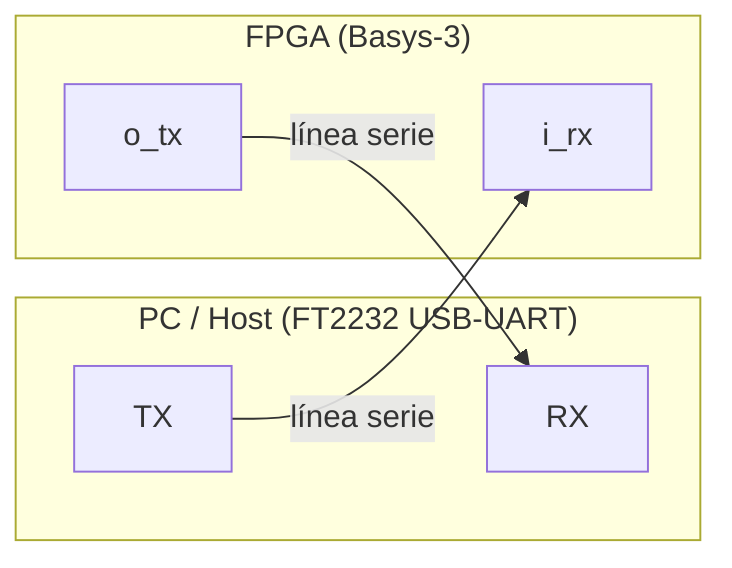
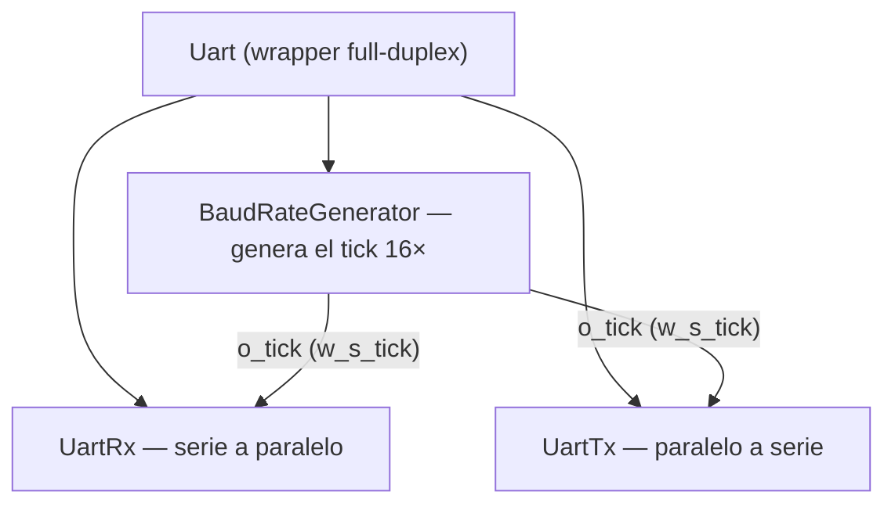
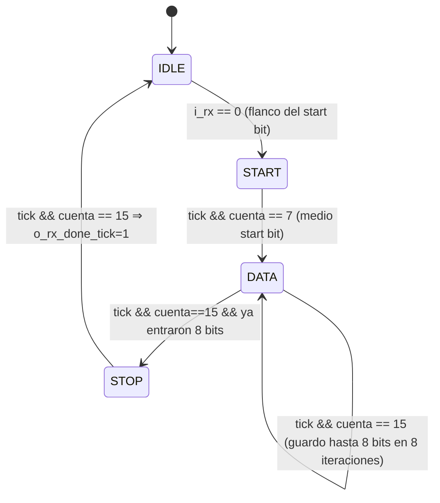
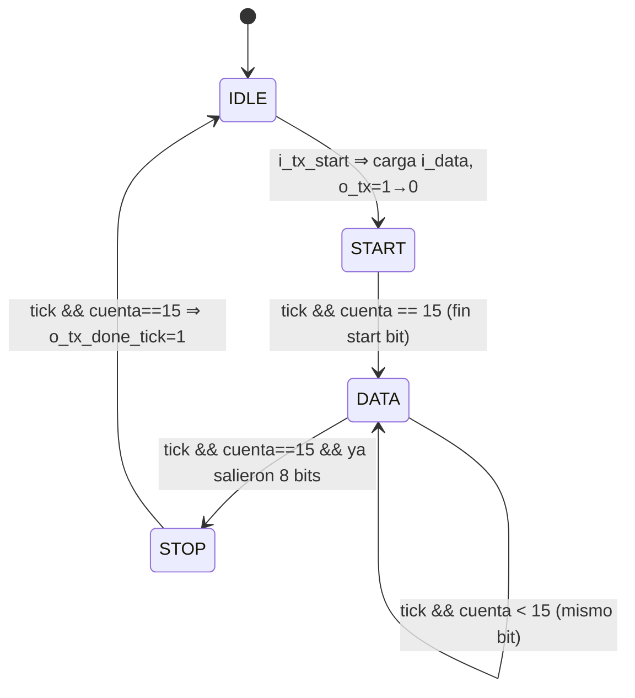
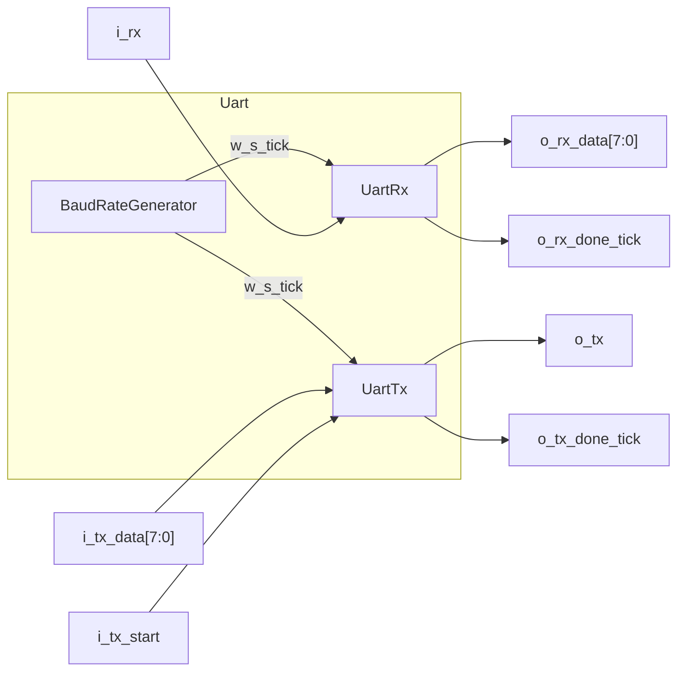
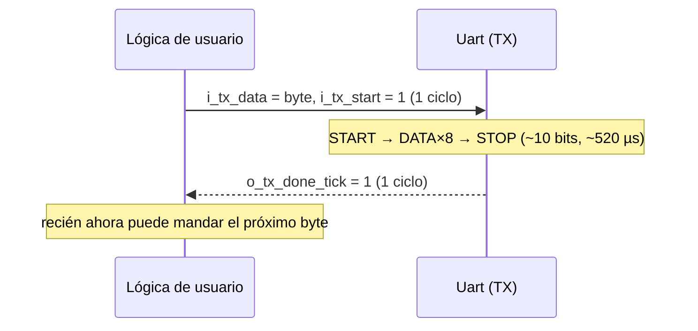
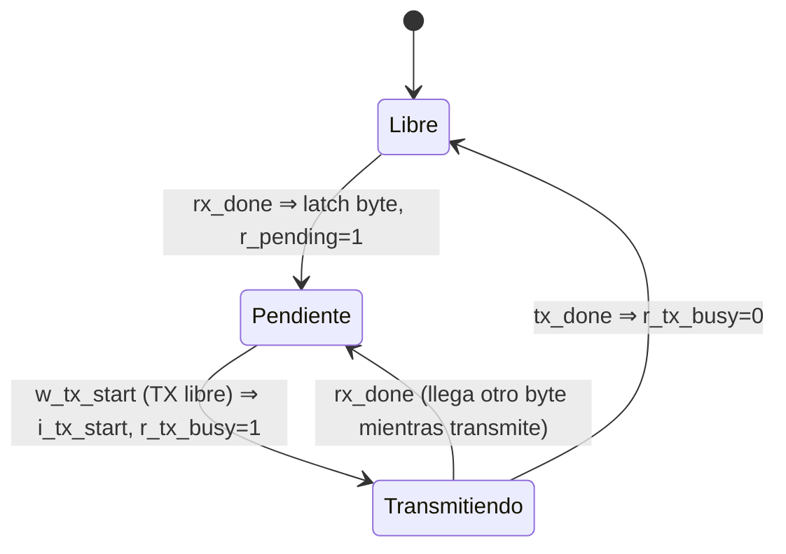
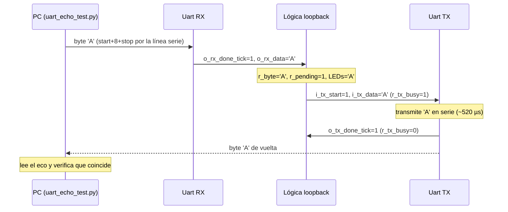

# UART — Teoría, implementación y loopback

Este documento explica, de menor a mayor nivel:

1. [Qué es la UART y cómo funciona en general](#1-qué-es-la-uart)
2. [La trama 8N1 bit a bit](#2-la-trama-8n1)
3. [Baud rate y sobre-muestreo (oversampling)](#3-baud-rate-y-sobre-muestreo)
4. [Arquitectura de la implementación](#4-arquitectura-de-la-implementación)
5. [`BaudRateGenerator`](#5-baudrategenerator)
6. [`UartRx` — el receptor](#6-uartrx--el-receptor)
7. [`UartTx` — el transmisor](#7-uarttx--el-transmisor)
8. [`Uart` — el wrapper full-duplex](#8-uart--el-wrapper-full-duplex)
9. [El handshake con el resto del sistema](#9-el-handshake-rx_done--tx_done)
10. [El loopback (`UartLoopbackTop`)](#10-el-loopback-uartloopbacktop)
11. [Parámetros, pines y cómo probar](#11-parámetros-pines-y-cómo-probar)
12. [Limitaciones conocidas](#12-limitaciones-conocidas)

> Los archivos viven en `src/sources_1/UART/`. Esta implementación se usó en la
> Stage 9a (validación por eco) y es la base de la interfaz de la `DebugUnit` (9b).

---

## 1. Qué es la UART

**UART** = *Universal Asynchronous Receiver/Transmitter*. Es un protocolo de
comunicación serie **asíncrono**: transmite los bits de un byte **uno detrás de
otro** por un solo cable por sentido, y **no envía un reloj** junto con los datos.

- **Serie:** en vez de 8 cables (uno por bit) se usa 1 cable por sentido. Para
  full-duplex hacen falta 2: **TX** (transmite) y **RX** (recibe). El TX de un
  extremo se conecta al RX del otro y viceversa.
- **Asíncrono:** no hay línea de reloj compartida. Ambos extremos se ponen de
  acuerdo de antemano en la **velocidad** (baud rate) y el **formato de trama**.
  El receptor recupera el sincronismo de cada byte detectando el flanco del *start
  bit* y midiendo el tiempo con su propio reloj.



En la Basys-3 el "otro extremo" es el puente **USB-UART (FT2232)**: la PC ve un
puerto serie (`/dev/ttyUSBx`) y los bytes viajan por USB hasta el chip puente,
que los convierte a las líneas serie `i_rx`/`o_tx` del FPGA.

---

## 2. La trama 8N1

La configuración que usamos es **8N1**: **8** bits de datos, **N**inguna paridad,
**1** bit de stop. La línea está en reposo en **alto (1)**. Una trama completa es:

```
        ┌── start      ┌── 8 bits de datos (LSB primero) ──┐   ┌── stop
        │              │                                   │   │
 idle   │  b0  b1  b2  b3  b4  b5  b6  b7                   │ idle...
 ─────┐ ┌───┬───┬───┬───┬───┬───┬───┬───┬───┐ ┌─────────
   1  └─┘ x │ x │ x │ x │ x │ x │ x │ x │ x │ │   1
      START └───┴───┴───┴───┴───┴───┴───┴───┘ STOP
       (0)         datos                       (1)
```

- **Reposo (idle):** la línea queda en `1` cuando no se transmite.
- **Start bit:** un `0`. Su flanco de bajada `1→0` le avisa al receptor "arranca un
  byte". Sirve de referencia temporal para todo el resto de la trama.
- **8 bits de datos, LSB primero:** se manda primero el bit menos significativo
  (`b0`) y último el más significativo (`b7`). Esto es clave para entender los
  registros de desplazamiento más abajo.
- **Stop bit:** un `1`. Garantiza que haya al menos un flanco `→1` antes del próximo
  start bit, y da margen de reposo entre bytes.

Ejemplo: enviar el byte `0x41` (`'A'` = `0100_0001` en binario, `b7..b0`). Como se
manda LSB primero, por la línea salen en este orden: `1,0,0,0,0,0,1,0`.

```
        S  b0 b1 b2 b3 b4 b5 b6 b7  P
 ────┐  ┌──┐           ┌──┐  ┌─────
  1  └──┘  └───────────┘  └──┘   1
        0  1  0  0  0  0  0  1  0   (0x41 = 'A', LSB first)
```

---

## 3. Baud rate y sobre-muestreo

### Baud rate

El **baud rate** es la cantidad de bits por segundo. Usamos **19200 baud**, así que
cada bit dura:

```
T_bit = 1 / 19200 ≈ 52,08 µs
```

Tanto la PC como el FPGA deben usar el mismo baud. Si difieren más de ~±3 %, el
receptor termina muestreando el bit equivocado y la comunicación se corrompe.

### El problema del sincronismo

Como no hay reloj compartido, el receptor sólo sabe **cuándo empieza** el byte (por
el flanco del start bit), pero no sabe exactamente dónde está el "centro" de cada
bit. Si muestreara justo en los bordes, cualquier pequeño desfasaje de reloj o de
baud lo haría leer mal.

### La solución: oversampling 16×

El receptor corre un "tick" **16 veces más rápido** que el baud
(`19200 × 16 = 307200 ticks/s`). Así divide cada bit en 16 sub-intervalos y puede:

1. Detectar el flanco del start bit con buena resolución.
2. Esperar **medio bit** (8 ticks) para ubicarse en el **centro** del start bit.
3. A partir de ahí, avanzar **16 ticks por bit** para muestrear siempre cerca del
   **centro** de cada bit de datos — el punto más estable, lejos de los bordes.

```
 Un bit dividido en 16 ticks (oversampling):

 tick:  0  1  2  3  4  5  6  7  8  9 10 11 12 13 14 15
        |--|--|--|--|--|--|--|--|--|--|--|--|--|--|--|--|
                                ▲
                             centro (se muestrea acá)
```

Esto da tolerancia a desfasajes de reloj y a pequeñas diferencias de baud entre los
dos extremos.

---

## 4. Arquitectura de la implementación

Cuatro módulos, jerarquía simple:



| Módulo | Archivo | Rol |
|--------|---------|-----|
| `BaudRateGenerator` | `BaudRateGenerator.sv` | Divide el reloj y emite un pulso (`o_tick`) a `baud × 16`. |
| `UartRx` | `UartRx.sv` | Recibe la trama serie y entrega el byte en paralelo. |
| `UartTx` | `UartTx.sv` | Toma un byte en paralelo y lo emite en serie. |
| `Uart` | `Uart.sv` | Instancia los tres y comparte el tick entre RX y TX. |

Convenciones: SystemVerilog con `logic`, `always_ff`/`always_comb`, enums tipados
para los estados, prefijos `i_`/`o_`/`w_`/`r_`, reset **síncrono activo-alto**.

---

## 5. `BaudRateGenerator`

Es un simple **divisor de reloj**. Cuenta ciclos del reloj del sistema y, cada
`N_CONT` ciclos, emite un pulso de **un solo ciclo** (`o_tick`).

```
N_CONT = CLK / (BAUDRATE × OVERSAMPLE) = 100_000_000 / (19200 × 16) = 325,5 → 325
```

```systemverilog
always_ff @(posedge i_clk) begin
    if (i_reset)                              r_counter <= '0;
    else if (r_counter == N_CONT-1)           r_counter <= '0;   // último ciclo: reinicia
    else                                      r_counter <= r_counter + 1'b1;
end
assign o_tick = (r_counter == N_CONT-1);      // pulso de 1 ciclo
```

Forma de onda (con `N_CONT = 325`, el tick dura 1 ciclo de reloj cada 325):

```
 i_clk    ┐_┌─┐_┌─┐_  ... (100 MHz)
 r_counter 0  1  2 ... 323 324  0   1   2 ...
 o_tick   ___________________⎺⎺____________   (1 pulso cada 325 ciclos)
                              ↑
                       r_counter == 324
```

**Precisión del baud:** con `N_CONT = 325`, el tick real es
`100e6 / 325 = 307,69 kHz`, y el baud real `307,69k / 16 = 19230,8`. El error
respecto a 19200 es **+0,16 %**, muy por debajo del límite (~±3 %) que tolera la UART.

> El conteo es 0…`N_CONT-1` y el pulso sale en `N_CONT-1`, así que el período del
> tick es exactamente `N_CONT` ciclos (se corrigió el off-by-one del diseño de
> referencia, que daba `N_CONT+1`).

---

## 6. `UartRx` — el receptor

Convierte la trama serie de `i_rx` en un byte paralelo (`o_data`) y pulsa
`o_rx_done_tick` un ciclo cuando terminó. Es una FSM de 4 estados sincronizada con
el `i_s_tick` del baud generator.



- **IDLE:** mira `i_rx` en cada ciclo de reloj. Cuando ve `0` (start bit) arranca y
  pone el contador de ticks en 0.
- **START:** cuenta ticks hasta `SB_TICK/2 - 1 = 7`. Como el start bit dura 16
  ticks, llegar a 8 ticks ubica al receptor en el **centro del start bit**. Desde
  acá, cada 16 ticks cae en el centro de un bit.
- **DATA:** cada `SB_TICK = 16` ticks muestrea `i_rx` y lo mete por el **MSB** del
  registro de desplazamiento. Repite 8 veces.
- **STOP:** espera el bit de stop completo (16 ticks) y pulsa `o_rx_done_tick`.

### Por qué entra por el MSB para recibir "LSB primero"

El bit que llega primero por la línea es `b0` (el LSB del byte). La línea clave es un
**registro de desplazamiento a la derecha** donde el bit nuevo entra por el **MSB**:

```systemverilog
 w_next_shiftreg = { i_rx, r_shiftreg[DBIT-1:1] };
//                   └─┬─┘  └──────┬──────────┘
//                  bit nuevo   los 7 bits de arriba del registro actual
//                  (→ bit 7)   (se corren a la derecha; r_shiftreg[0] se descarta)
```

La concatenación `{ }` arma los 8 bits así: `i_rx` ocupa el bit 7 y `r_shiftreg[7:1]`
baja a ocupar los bits `[6:0]`. Es decir: **se corre todo a la derecha, se cae el bit 0
y el bit nuevo entra arriba**.

Llamando a los bits por orden de llegada (`d0` = primero = LSB … `d7` = último = MSB),
el primero va "bajando" hasta el fondo y queda en el bit 0:

```
 llega d0:  [ d0  ·  ·  ·  ·  ·  ·  · ]   d0 entra en bit7
 llega d1:  [ d1 d0  ·  ·  ·  ·  ·  · ]   d0 baja a bit6
 llega d2:  [ d2 d1 d0  ·  ·  ·  ·  · ]
   ...                                    (· = basura vieja que se va cayendo)
 llega d7:  [ d7 d6 d5 d4 d3 d2 d1 d0]   ← byte completo, d0 en bit0  ✓
 bit nº:       7  6  5  4  3  2  1  0
```

Así el orden serie se "deshace" solo, sin invertir nada. Ejemplo: recibir `'A'`
(`0x41 = 0100_0001`) llega como `d0..d7 = 1,0,0,0,0,0,1,0` y termina en
`bits[7:0] = 0100_0001 = 0x41`. El TX hace lo simétrico (`r_shiftreg >> 1` y emite
`r_shiftreg[0]`): saca por abajo el LSB primero, justo la operación inversa.

### Dónde cae el muestreo (alineación al centro)

```
 i_rx   ──┐        start(16t)         b0(16t)            b1(16t)
   1      └───────────────────────────────────────...
          ▲           ▲                   ▲                  ▲
       detecta     +8 ticks            +16 ticks          +16 ticks
       (IDLE→START)  (centro start)    (centro b0)        (centro b1)
                     START→DATA        muestrea b0        muestrea b1
```

El primer muestreo de datos ocurre 16 ticks *después* del centro del start bit, es
decir, en el **centro de b0**. De ahí en más, un muestreo por bit, siempre centrado.

---

## 7. `UartTx` — el transmisor

Toma un byte (`i_data`) cuando recibe un pulso en `i_tx_start`, lo emite en serie
por `o_tx` (start + 8 datos LSB primero + stop) y pulsa `o_tx_done_tick` al terminar.
La línea queda en reposo en `1`.



- **IDLE:** `o_tx = 1`. Al ver `i_tx_start`, copia `i_data` al shift register y va a START.
- **START:** `o_tx = 0` (start bit) durante 16 ticks.
- **DATA:** `o_tx = shiftreg[0]` (emite el **LSB**) y cada 16 ticks desplaza a la
  derecha (`shiftreg >> 1`) para poner el siguiente bit en el LSB. 8 veces → LSB primero.
- **STOP:** `o_tx = 1` (stop bit) durante 16 ticks y pulsa `o_tx_done_tick`.

```
            IDLE   START      DATA (8 bits, LSB→MSB)        STOP   IDLE
 o_tx   ────────┐      ┌──b0──┬──b1──┬ ... ┬──b7──┐      ┌──────
   1            └──0───┘      │      │     │      │      │   1
              i_tx_start    shiftreg[0] cada 16 ticks   stop=1
                                                         o_tx_done_tick=1
```

---

## 8. `Uart` — el wrapper full-duplex

Instancia un `BaudRateGenerator`, un `UartRx` y un `UartTx`, y **comparte el mismo
tick** (`w_s_tick`) entre RX y TX. Expone una interfaz paralela cómoda:



| Puerto | Dir | Significado |
|--------|-----|-------------|
| `i_rx` | in | línea serie de entrada |
| `o_tx` | out | línea serie de salida |
| `o_rx_data[7:0]` | out | byte recibido (válido cuando pulsa `o_rx_done_tick`) |
| `o_rx_done_tick` | out | pulso de 1 ciclo: hay un byte nuevo |
| `i_tx_data[7:0]` | in | byte a transmitir |
| `i_tx_start` | in | pulso para iniciar la transmisión (sólo con TX libre) |
| `o_tx_done_tick` | out | pulso de 1 ciclo: terminó de transmitir |

El mismo tick sirve para ambos: el RX lo usa para sobre-muestrear (16 por bit) y el
TX para medir cada bit (16 ticks por bit). Es full-duplex: puede recibir y transmitir
a la vez sin conflicto.

---

## 9. El handshake `rx_done` / `tx_done`

> **Son señales internas del FPGA, no salen hacia la PC.** Entre la PC y el FPGA
> viajan **sólo los bits de la trama serie** por dos cables: `i_rx` (pin B18) y
> `o_tx` (pin A18), más GND. Los `*_done_tick` conectan el módulo `Uart` con la
> lógica que lo usa (`UartLoopbackTop` / `DebugUnit`), no con la PC. La PC se entera
> de que un byte terminó por el **stop bit** de la trama, gracias a su propia UART
> (el chip FT2232 + pyserial), no por estas señales.

La UART no tiene FIFO: maneja **un byte por vez** con señales tipo pulso.

**Recepción:** cuando `o_rx_done_tick` pulsa (1 ciclo), `o_rx_data` tiene el byte.
El consumidor debe capturarlo en ese ciclo (o en el siguiente, antes de que llegue
otro byte).

**Transmisión:** el consumidor pone el byte en `i_tx_data` y pulsa `i_tx_start`
**un ciclo** mientras el TX está libre. El TX tarda ~10 bits (~520 µs a 19200) y
avisa con `o_tx_done_tick`. No hay que pulsar `i_tx_start` de nuevo hasta entonces.



---

## 10. El loopback (`UartLoopbackTop`)

Es el **top de prueba** de la Stage 9a: un eco. Reenvía por TX cada byte que llega
por RX, y muestra el último byte en los 8 LEDs. Sirve para validar RX + TX + baud
generator en la placa **sin depender del pipeline ni de la DebugUnit**.

### La lógica

El detalle fino es no perder bytes si llega uno mientras el TX todavía está
transmitiendo el anterior. Para eso usa dos flags:

- `r_pending` — hay un byte capturado esperando ser reenviado.
- `r_tx_busy` — el TX está ocupado transmitiendo.

```systemverilog
assign w_tx_start = r_pending & ~r_tx_busy;     // arranca TX si hay pendiente y el TX está libre

always_ff @(posedge i_clk) begin
    if (i_reset) begin ... end
    else begin
        if (w_tx_start)       begin r_pending <= 0; r_tx_busy <= 1; end  // lanza TX
        if (w_tx_done_tick)         r_tx_busy <= 0;                       // TX terminó
        if (w_rx_done_tick)   begin r_byte <= w_rx_data; r_pending <= 1; end // capturar (prioridad)
    end
end
assign o_led = r_byte;
```

La captura de RX se evalúa **última**, así que tiene **prioridad** sobre el clear de
`r_pending`: si justo llega un byte nuevo en el mismo ciclo en que se lanza el
anterior, `r_pending` queda en 1 y el byte nuevo no se pierde. (A 19200 con eco
inmediato RX y TX van a la misma velocidad, así que en la práctica casi nunca se
solapan, pero el flag lo cubre igual.)

### Diagrama de la FSM del eco



### Secuencia completa de un eco (PC ↔ FPGA)



El test `uart_echo_test.py` (en la skill `program-board`) manda `0x00..0xFF`, lee el
eco de cada byte y verifica que vuelva idéntico (PASS 256/256).

---

## 11. Parámetros, pines y cómo probar

### Parámetros (defaults)

| Parámetro | Valor | Dónde |
|-----------|-------|-------|
| `CLK` | 100 MHz | reloj de la Basys-3 (pin W5) |
| `BAUDRATE` | 19200 | igual que la GUI Python |
| `OVERSAMPLE` / `SB_TICK` | 16 | sobre-muestreo |
| `NB_DATA` / `DBIT` | 8 | bits por byte (8N1) |

### Pines en la Basys-3 (`basys3_uart_loopback.xdc`)

| Señal | Pin | Nota |
|-------|-----|------|
| `i_clk` | W5 | reloj 100 MHz |
| `i_reset` | U18 | botón central (btnC) |
| `i_rx` | B18 | RX del puente USB-UART → FPGA |
| `o_tx` | A18 | TX del FPGA → puente USB-UART |
| `o_led[7:0]` | U16,E19,U19,V19,W18,U15,U14,V14 | último byte recibido |

### Cómo probar (skill `program-board`)

```bash
# 1. chequear entorno serie (USB / puerto / pyserial)
bash .claude/skills/program-board/scripts/check_board.sh
# 2. generar el bitstream (top por defecto = UartLoopbackTop)
vivado -mode batch -source .claude/skills/program-board/scripts/build_bitstream.tcl
# 3. programar la Basys-3
vivado -mode batch -source .claude/skills/program-board/scripts/program_board.tcl
# 4. test de eco 0x00..0xFF
python3 .claude/skills/program-board/scripts/uart_echo_test.py --port /dev/ttyUSB1
```

---

## 12. Limitaciones conocidas

- **Sin FIFO:** un byte por vez. Si el consumidor no lee `o_rx_data` antes del
  próximo `o_rx_done_tick`, lo pisa. (En la `DebugUnit` no es problema porque la FSM
  procesa cada byte antes de pedir el siguiente.)
- **Sin paridad ni detección de errores de trama:** es 8N1 puro. No se chequea el
  nivel del stop bit ni se reporta *framing error*.
- **Sin manejo de *break* / ruido en la línea:** un glitch a `0` en reposo puede ser
  interpretado como start bit. El muestreo al centro mitiga el ruido, pero no hay
  validación de mitad de start bit (algunos diseños re-chequean en el tick 7 que la
  línea siga en 0; este no lo hace).
- **Baud y reloj fijos por parámetro:** cambiar de 100 MHz o de 19200 requiere
  recompilar (no hay divisor configurable en runtime).

---

### Referencias cruzadas

- Implementación: `src/sources_1/UART/*.sv`
- Constraints: `src/constrs_1/new/basys3_uart_loopback.xdc`
- Registro de la etapa: [`plans/stage9a.md`](../plans/stage9a.md)
- Uso en la interfaz de debug: [`plans/stage9b.md`](../plans/stage9b.md) y `src/sources_1/Debug/DebugUnit.sv`
