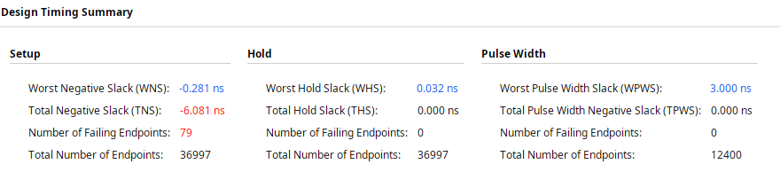
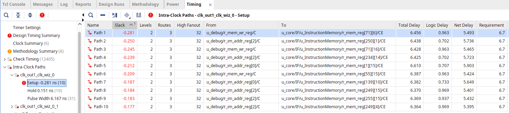
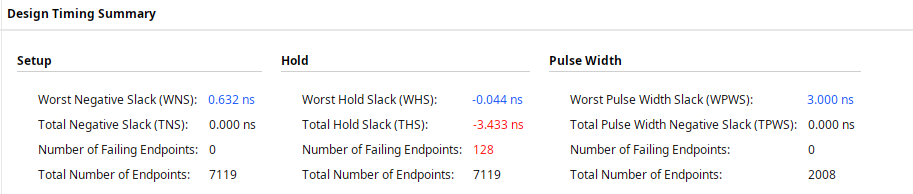
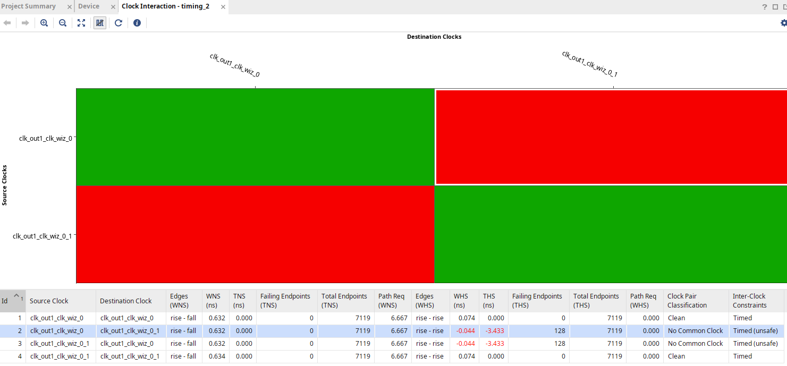
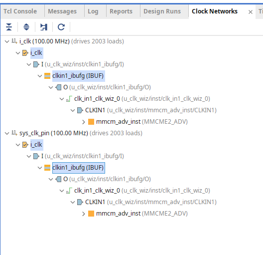
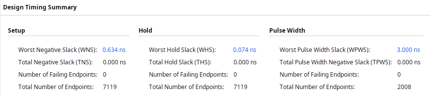
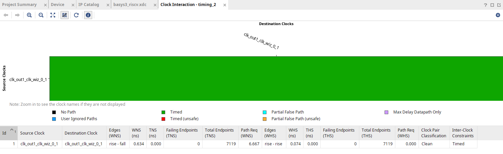

# Reporte — Cierre de timing a 75 MHz — RiscvTop

**Fecha:** 2026-07-14
**Top:** `RiscvTop` (`src/sources_1/Top/RiscvTop.sv`)
**Device:** Artix-7 `xc7a35tcpg236-1` (Basys-3), speed grade **-1**
**Frecuencia:** 75 MHz (reloj del SoC vía MMCM / Clock Wizard)

> **Resumen:** partiendo de un diseño que **no cerraba setup a 75 MHz**, dos cambios lo
> llevaron a cerrar timing completo (WNS +0.634 ns, WHS +0.074 ns, 0 endpoints fallando):
> **(1)** quitar el reset síncrono global de las memorias — permite inferir BRAM y arregla
> el setup; **(2)** quitar un `create_clock -add` duplicado en el XDC — elimina un falso
> problema de hold. El techo de ~75 MHz documentado en
> [`report-fmax-sweep-dw32-20260629.md`](report-fmax-sweep-dw32-20260629.md) queda superado.

---

## 1. Punto de partida — setup no cierra

<div align="center">
  
</div>

A 75 MHz el **setup falla**: WNS **−0.281 ns**, 79 endpoints fallando. Los 10 peores paths
van todos **desde la `DebugUnit`** (`r_mem_wr`, `r_im_addr`) **hacia el clock-enable de los
registros de `InstructionMemory`** — el camino de carga de programa, con **85 % de net
delay** (5.5 ns de ruteo vs 1 ns de lógica).

<div align="center">
  
</div>

**Causa:** `InstructionMemory` (y `DataMemory`) se sintetizan como **arrays de flip-flops en
fabric**, no como BRAM. El culpable es el reset síncrono que limpia todo el array:

```systemverilog
if (i_reset) for (int i = 0; i < 2**NB_ADDR; i++) r_mem[i] <= '0;
```

Un BRAM no puede borrar todas sus palabras en un ciclo, así que ese patrón fuerza miles de
FFs individuales + un decoder de escritura por palabra. Las señales de la `DebugUnit` deben
alcanzar físicamente esos ~8000 FFs repartidos por el chip → alto fanout y net delay
enorme. Es también lo que dispara el "cliff" de control sets documentado en el barrido de
Fmax (replicación de registros a ≥70 MHz).

---

## 2. Fix 1 — memorias sin reset global → setup cierra, aparece falso hold

Se comentó la rama `if (i_reset) ...` en `InstructionMemory.sv` y `DataMemory.sv`, dejando
solo la escritura condicionada por el write-enable.

<div align="center">
  
</div>

**Setup resuelto:** WNS **−0.281 → +0.632 ns**, 0 fallas. El total de endpoints cae de
**36997 a 7119** — las memorias ahora se mapean a **BRAM real**, tal como se esperaba.

Pero aparece **hold roto**: WHS **−0.044 ns**, 128 endpoints fallando (antes hold estaba
holgado). Los paths cruzan entre dos objetos de reloj, `clk_out1_clk_wiz_0` y
`clk_out1_clk_wiz_0_1`, que Vivado reporta como **Inter-Clock**.

---

## 3. Fix 2 — el hold era un artefacto de un reloj duplicado en el XDC

**Clock Interaction** muestra que el problema es solo entre los dos relojes cruzados,
marcados **"No Common Clock / Timed (unsafe)"** (los checks intra-reloj cierran con +0.074
ns):

<div align="center">
  
</div>

**Clock Networks** revela la causa raíz: **dos relojes (`i_clk` y `sys_clk_pin`) sobre el
mismo pin físico**, recorriendo idéntico buffer, neto y pin del MMCM ("drives 2003 loads"
ambos):

<div align="center">
  
</div>

El origen estaba en `src/constrs_1/new/basys3_riscv.xdc`:

```tcl
create_clock -add -name sys_clk_pin ... [get_ports i_clk]   # ANTES
create_clock      -name sys_clk_pin ... [get_ports i_clk]   # DESPUÉS (fix)
```

El flag **`-add`** agregaba un segundo reloj sobre un pin que ya tenía uno, en vez de
definir uno solo. Vivado no puede asumir que dos relojes distintos están en fase (aunque en
el silicio son la misma señal) → análisis de hold conservador que fallaba por −0.044 ns.
**No es un problema físico**, es una restricción mal escrita.

---

## 4. Resultado final — timing cerrado a 75 MHz

Tras ambos fixes, con un único reloj (`clk_out1_clk_wiz_0_1`):

<div align="center">
  
</div>

| | WNS/WHS/WPWS | TNS/THS/TPWS | Failing |
|---|:---:|:---:|:---:|
| **Setup** | +0.634 ns | 0 | 0 |
| **Hold** | +0.074 ns | 0 | 0 |
| **Pulse Width** | +3.000 ns | 0 | 0 |

Clock Interaction queda en una sola fila **"Clean / Timed"**, sin cruces inter-clock:

<div align="center">
  
</div>

**El diseño cierra timing completo a 75 MHz**, superando el techo de ~65 MHz vigente.
